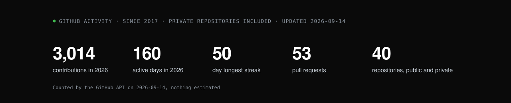
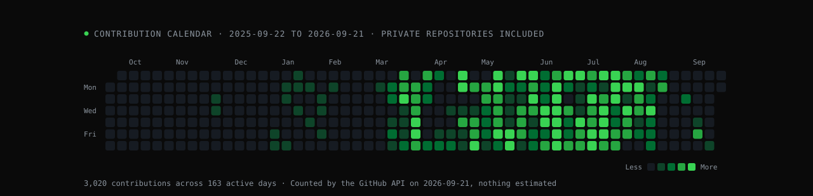

I work at VASS. Since late 2022 I have been on the Inditex account, on the app
that store staff across the group use every day, and since 2025 I lead its iOS
team. Before that I moved through banking and retail for other clients of ours:
Santander, Mercadona, Unicaja, Banco Pichincha. All of those are client
projects — VASS is the employer.

Then there is my own work, which I sign as OgamLabs. Two apps on the App Store,
and I keep their API, their database and their server running myself.

Based in Madrid. Happy to talk about senior iOS work, leading a team,
architecture, or developer tooling.

**[Portfolio](https://ogamlabs.com)** ·
**[LinkedIn](https://www.linkedin.com/in/oscarcantongarcia/)** ·
**[Contact](mailto:soporte@ogamlabs.com)**

## Selected work

### CholloGas

Fuel prices across Spain and France, from the official open data. The app is
Swift and SwiftUI; the API is TypeScript on Fastify over PostgreSQL, and I
operate it. The public engineering case study covers the Swift 6 offline-first
client, the official-data ingestion and the production operations — without
exposing the product source.

[Product site](https://chollogas.ogamlabs.com) ·
[App Store](https://apps.apple.com/es/app/chollogas-gasolineras-baratas/id6773014516) ·
[Engineering case study](https://github.com/magnoscg/chollogas-case-study)

### Hilo

A published SwiftUI word game: five words hiding one common thread, one short
round a day. 4,015 original puzzles, 11 store locales, 1,128 passing tests. The
long part was not the game but the pipeline that generates, validates and
reviews the catalogue and the store assets.

[Product site](https://hilo.ogamlabs.com) ·
[App Store](https://apps.apple.com/es/app/id6779929637) ·
[Engineering case study](https://github.com/magnoscg/hilo-case-study)

### iOS Architecture Reference

A real Xcode application that builds, not a diagram: a single app target
inspired by Clean Architecture, with MVVM, typed Router navigation and manual
factory-based dependency injection. 194 Swift Testing cases across 27 suites
hold the boundaries in place, with zero third-party package dependencies.

[Code and decisions](https://github.com/magnoscg/ios-architecture-reference) ·
[CI checks](https://github.com/magnoscg/ios-architecture-reference/actions/workflows/ci.yml)

### AnvilCLI

A Go CLI that sets up iOS projects with Clean Architecture, MVVM, Router
navigation and optional AI coding packs. Its transactional generator validates
every destination before it writes and never overwrites a file.
421 automated tests; its 34 provenance-tracked skills include
25 self-contained Swift 6 examples.

[Code and security](https://github.com/magnoscg/anvil) ·
[CI checks](https://github.com/magnoscg/anvil/actions/workflows/ci.yml)

## AI-assisted engineering in development

Two tools I built because I needed them. Each has a public case study; the
tools themselves are not released yet.

PRDPlanner and HarnessHub

### PRDPlanner

A PRD → plan → build workflow with bounded context, dependency-aware phases,
parallel verification and a stage whose job is to refute what the other stages
found, before a human decides. A public edition is in preparation.

[Engineering case study](https://github.com/magnoscg/prdplanner-case-study)

### HarnessHub

A local-first composer for skills, subagents, plugins and MCPs that produces
reproducible multi-harness bundles without installing or executing anything it
packages. It is currently in local beta.

[Engineering case study](https://github.com/magnoscg/harnesshub-case-study)

## Engineering focus

- **Apple platforms** — Swift 6, SwiftUI, UIKit, Observation, SwiftData,
  StoreKit 2, WidgetKit, App Intents
- **Architecture** — Clean Architecture, MVVM, Router/Coordinator, modular SPM
  packages, dependency injection
- **Quality** — Swift Testing, XCTest, strict concurrency, accessibility,
  performance profiling, CI/CD
- **Product systems** — Go and TypeScript tooling, APIs, PostgreSQL, data
  pipelines, code generation, MCP servers, release automation

I like simple designs, decisions written down with their cost, and tests that
protect behaviour rather than implementation.
