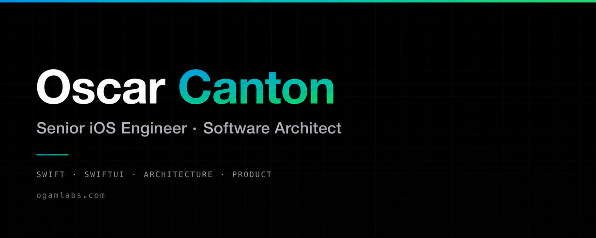

I build and operate iOS products end to end: the interface people use, the
architecture that keeps it maintainable, and the backend and release systems
that keep it running.

**[Portfolio](https://ogamlabs.com)** ·
**[LinkedIn](https://www.linkedin.com/in/oscarcantongarcia/)** ·
**[Contact](mailto:soporte@ogamlabs.com)**

## Selected work

- **CholloGas — production iOS, backend, and data operations.**
  [Product site](https://chollogas.ogamlabs.com) ·
  [App Store](https://apps.apple.com/es/app/chollogas-gasolineras-baratas/id6773014516)  
  Backed by a TypeScript API, PostgreSQL, and an operational MITECO ingestion
  pipeline.
- **Hilo — pre-release SwiftUI product and release pipeline.**
  [Product site](https://hilo.ogamlabs.com) ·
  [Engineering case study](https://github.com/magnoscg/hilo-case-study)  
  4,015 original puzzles, 11 store locales, 1,128 passing tests, and a
  documented asset pipeline.
- **AnvilCLI — open-source iOS developer tooling.**
  [Code and releases](https://github.com/magnoscg/anvil)  
  A Go CLI that scaffolds iOS projects with Clean Architecture, MVVM, Router
  navigation, golden tests, and optional AI coding packs.

The product code for Hilo and CholloGas remains private. Their public material
documents architecture, trade-offs, testing, operations, and measurable
engineering outcomes without exposing the products themselves.

## AI-assisted engineering in development

- **PRDPlanner** — a PRD → plan → build workflow with bounded context,
  dependency-aware phases, parallel verification, adversarial review, and
  explicit human gates. A public edition is in preparation.
- **HarnessHub** — a local-first composer for compatible skills, subagents,
  plugins, and MCPs that produces reproducible multi-harness bundles without
  installing or executing their contents. Currently in local beta.

These projects remain labelled as in development until their public editions
can provide the same level of evidence as the work above.

## Engineering focus

- **Apple platforms:** Swift 6, SwiftUI, UIKit, Observation, SwiftData,
  StoreKit 2, WidgetKit, and App Intents
- **Architecture:** Clean Architecture, MVVM, Router/Coordinator, modular SPM
  packages, and dependency injection
- **Quality:** Swift Testing, XCTest, strict concurrency, accessibility,
  performance profiling, and CI/CD
- **Product systems:** Go and TypeScript tooling, APIs, PostgreSQL, data
  pipelines, code generation, MCP servers, and release automation

I value simple designs, explicit trade-offs, tests that protect behaviour, and
documentation that makes engineering decisions reviewable.

Based in Madrid. Open to conversations about senior iOS engineering, technical
leadership, software architecture, and developer tooling.
